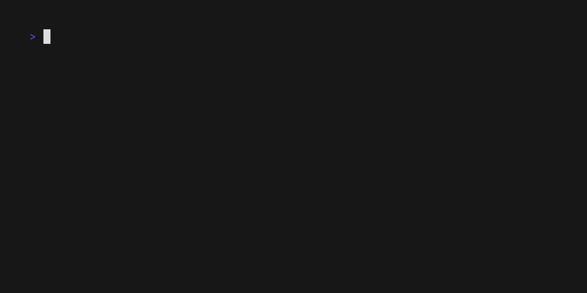

# WaveBoard

Play the notes of a standard 88 key keyboard on your computer keyboard.

## Installation

```{sh}
go install github.com/lezhou8/waveboard@latest
```

## Usage

Just run `waveboard` on your terminal and mash away at your keyboard


